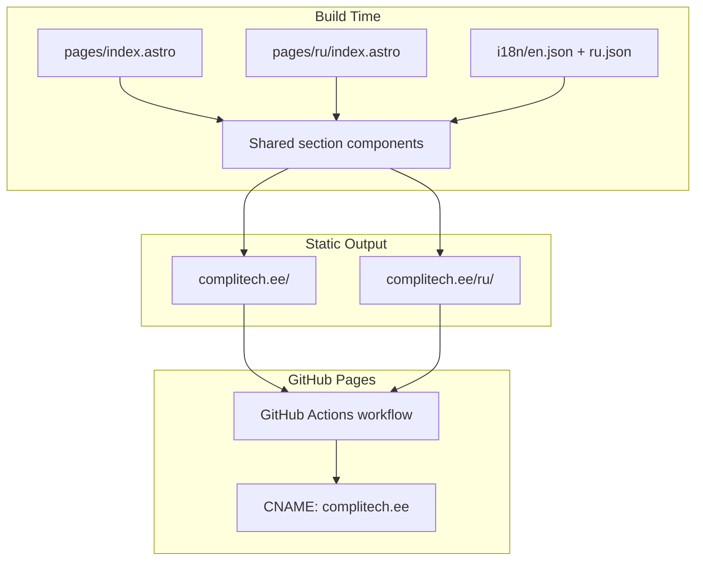

# Compli Tech Business Card Website Plan

## 1. Tech Stack Recommendation

**Recommended: Astro 5 + Tailwind CSS 4 + TypeScript**


| Option               | Verdict                                                                                                                                                                             |
| -------------------- | ----------------------------------------------------------------------------------------------------------------------------------------------------------------------------------- |
| **Astro 5** (chosen) | Best fit: ships zero JS by default, outputs pure static HTML, has first-class i18n routing, official GitHub Pages guide, and component-based maintainability for 5+ languages later |
| Plain HTML/JS        | Works for 2 pages, but copy/SEO/meta duplication becomes painful at 5 locales                                                                                                       |
| Next.js / Nuxt       | Overkill; requires SSR adapter or awkward static export for a brochure site                                                                                                         |
| Hugo / Eleventy      | Viable, but weaker component ergonomics for a polished UI with reusable blocks                                                                                                      |


**Supporting packages:**

- `@astrojs/tailwind` — utility-first styling
- `@astrojs/sitemap` — multilingual sitemap for Google Search Console
- `@astrojs/check` + `typescript` — type-safe i18n keys
- `sharp` (via Astro image) — auto WebP conversion for logos
- **Contact form:** [Web3Forms](https://web3forms.com) (recommended) — free, static-friendly, single `access_key` env var; Formspree as a one-line fallback

**Why not a heavier i18n library (Paraglide, astro-i18n-aut)?** For a ~6-section one-pager with 2 languages (scaling to 5), JSON translation files + Astro built-in routing is the simplest correct solution. Add a library only if UI strings exceed ~100 keys or you need ICU pluralization.

---

## 2. Architecture Overview




**URL strategy** (matches your requirement):

- English (default): `https://complitech.ee/`
- Russian: `https://complitech.ee/ru/`
- Future Estonian/Polish/German: add thin wrapper pages at `/et/`, `/pl/`, `/de/` — no refactor needed

**i18n config** in `[astro.config.mjs](astro.config.mjs)`:

```js
i18n: {
  defaultLocale: 'en',
  locales: ['en', 'ru', 'et', 'de', 'pl'], // future-ready
  routing: {
    prefixDefaultLocale: false,
    redirectToDefaultLocale: true, // /en/ → / (avoids duplicate SEO)
  },
}
```

**Page pattern** (DRY — each locale page is ~5 lines):

```astro
---
// src/pages/index.astro (EN)
import HomePage from '../components/HomePage.astro';
---
<HomePage locale="en" />
```

```astro
---
// src/pages/ru/index.astro (RU)
import HomePage from '../components/HomePage.astro';
---
<HomePage locale="ru" />
```

All internal links use `getRelativeLocaleUrl(locale, path)` from `astro:i18n` — never hardcode `/ru/...`.

---

## 3. Project Structure

```
complitech/
├── .github/workflows/deploy.yml
├── astro.config.mjs
├── tailwind.config.mjs
├── tsconfig.json
├── package.json
├── public/
│   ├── CNAME                          # complitech.ee
│   ├── robots.txt
│   └── images/
│       ├── logo-big.webp              # converted from logo-big.jpg
│       ├── logo-small.webp            # converted from logo-small.jpg
│       └── brands/                    # partner logos (added incrementally)
├── src/
│   ├── i18n/
│   │   ├── config.ts                  # locale list, labels, dir (ltr)
│   │   ├── ui.ts                      # typed t(locale, key) helper
│   │   ├── en.json
│   │   └── ru.json
│   ├── layouts/
│   │   └── BaseLayout.astro           # html lang, SEO, JSON-LD, fonts
│   ├── components/
│   │   ├── HomePage.astro             # assembles all sections
│   │   ├── seo/
│   │   │   ├── SEOHead.astro          # title, description, OG, hreflang
│   │   │   └── JsonLd.astro           # LocalBusiness schema
│   │   ├── Header.astro               # sticky nav + language switcher
│   │   ├── Hero.astro
│   │   ├── About.astro
│   │   ├── Brands.astro               # 18-brand logo grid
│   │   ├── Services.astro             # 3 category cards
│   │   ├── Contact.astro              # form + contact channels
│   │   ├── Footer.astro
│   │   └── LanguageSwitcher.astro
│   ├── pages/
│   │   ├── index.astro
│   │   └── ru/index.astro
│   └── styles/
│       └── global.css                 # Tailwind directives + CSS vars
```

**Logo assets:** Move `[logo-big.jpg](logo-big.jpg)` and `[logo-small.jpg](logo-small.jpg)` from repo root into `public/images/`, convert to WebP at build time via Astro `<Image>` component (with JPG fallback via `<picture>`).

**Partner brand logos:** The 18 brands are copyrighted; the boilerplate will render a professional **text-name grid** with slots ready for `` swap. You (or we in a follow-up) add official press-kit logos into `public/images/brands/` as they become available. Structure:

Terumo, Gima, Radiometer, Ethicon, Beckman Coulter, Abbott, Covidien, Iris (Medtronic), Tem, NeoMedica, Instrumentation Laboratory, Thermo Fisher Scientific, BD, Siemens Healthineers, Roche, DiaSorin, Stago, Sysmex.

---

## 4. Design Direction (UI/UX)

Inspired by [integrainternational.pl](https://integrainternational.pl), labevolution.it, ivd.by — clean B2B medical distributor aesthetic:

- **Palette:** Deep navy (`#0B2D4F`) + medical teal accent (`#0E7C86`) + white/off-white backgrounds
- **Typography:** `Inter` (Google Fonts, preloaded) — corporate, highly legible
- **Layout:** Single-page with sticky anchor nav (`#about`, `#brands`, `#services`, `#contact`)
- **Hero:** Full-width, subtle gradient, logo + tagline + dual CTA buttons
- **Brands grid:** 3–4 column responsive grid, grayscale cards → color on hover
- **Services:** 3 icon cards with short descriptions (reference competitor card layouts)
- **Contact:** Split layout — left: phone/messengers/email/address; right: Web3Forms form
- **Accessibility:** Skip-to-content link, focus rings, `aria-label` on language switcher, sufficient contrast (WCAG AA)

---

## 5. SEO Implementation

### Per-locale meta (in `en.json` / `ru.json`)


| Field              | EN                                                                                                                                                               | RU                                                                                                                                                                               |
| ------------------ | ---------------------------------------------------------------------------------------------------------------------------------------------------------------- | -------------------------------------------------------------------------------------------------------------------------------------------------------------------------------- |
| `meta.title`       | Compli Tech | Medical & Laboratory Equipment Supply                                                                                                               | Compli Tech | Поставка медицинского и лабораторного оборудования                                                                                                                  |
| `meta.description` | OÜ Compli Tech — B2B wholesale supplier of certified medical and laboratory equipment, reagents, and consumables from leading global manufacturers across Europe. | OÜ Compli Tech — оптовый B2B-поставщик сертифицированного медицинского и лабораторного оборудования, реагентов и расходных материалов от ведущих мировых производителей в Европе. |


### `SEOHead.astro` will output per page:

- `<title>`, `<meta name="description">`
- Open Graph: `og:title`, `og:description`, `og:url`, `og:locale`, `og:locale:alternate`, `og:image`, `og:type`
- `<link rel="canonical">`
- `<link rel="alternate" hreflang="en">` + `hreflang="ru"` + `hreflang="x-default"`
- `<html lang="en">` or `lang="ru"`

### JSON-LD (`LocalBusiness` + `Organization`) — using your provided details:

```json
{
  "@context": "https://schema.org",
  "@type": ["Organization", "LocalBusiness"],
  "name": "Compli Tech OÜ",
  "legalName": "Compli Tech OÜ",
  "url": "https://complitech.ee",
  "logo": "https://complitech.ee/images/logo-big.webp",
  "description": "...",
  "vatID": "EE102318454",
  "address": {
    "@type": "PostalAddress",
    "streetAddress": "Astangu tn 66-60",
    "addressLocality": "Tallinn",
    "addressRegion": "Harjumaa",
    "postalCode": "13519",
    "addressCountry": "EE"
  },
  "contactPoint": [{
    "@type": "ContactPoint",
    "telephone": "+372-5621-1902",
    "email": "complitech@mail.ee",
    "contactType": "customer service",
    "availableLanguage": ["English", "Russian"]
  }]
}
```

### Performance

- Astro static HTML (no hydration unless form validation JS added later)
- WebP images with explicit `width`/`height` (prevent CLS)
- Preconnect to Google Fonts
- Minified CSS/JS in production build
- `@astrojs/sitemap` with `i18n` filter for per-locale URLs

---

## 6. Copywriting Drafts (EN + RU)

### Navigation


| Key      | EN       | RU         |
| -------- | -------- | ---------- |
| about    | About Us | О компании |
| brands   | Partners | Партнёры   |
| services | Services | Услуги     |
| contact  | Contact  | Контакты   |


### Hero

**EN**

- Tagline: *Working Worldwide for Your Benefit*
- Subtitle: *Integrated Laboratory Solutions Across Europe*
- Body: *OÜ Compli Tech is your trusted B2B partner for diagnostic laboratory supply. We deliver certified equipment, reagents, and consumables from the world's leading manufacturers — keeping your laboratory operating without interruption.*
- CTA primary: *Request a Quote*
- CTA secondary: *Contact Us*

**RU**

- Tagline: *Работаем по всему миру на вашу пользу*
- Subtitle: *Комплексные решения для лабораторий по всей Европе*
- Body: *OÜ Compli Tech — ваш надёжный B2B-партнёр в снабжении диагностических лабораторий. Мы поставляем сертифицированное оборудование, реагенты и расходные материалы от ведущих мировых производителей, обеспечивая бесперебойную работу вашей лаборатории.*
- CTA primary: *Запросить коммерческое предложение*
- CTA secondary: *Связаться с нами*

### About Us

**EN**

> Compli Tech OÜ is an international company based in Tallinn, Estonia, specializing in the wholesale supply of certified medical and laboratory equipment to healthcare institutions across Europe.
>
> We serve hospitals, clinics, medical centres, and diagnostic laboratories with a comprehensive portfolio of diagnostic instruments, certified reagents, calibrators, quality controls, and consumables from globally recognized manufacturers.
>
> Our value proposition is straightforward: through reliable global supply chains and direct manufacturer partnerships, we ensure the uninterrupted operation of your diagnostic laboratory — so you can focus on what matters most: patient care.

**RU**

> Compli Tech OÜ — международная компания с головным офисом в Таллине, Эстония, специализирующаяся на оптовых поставках сертифицированного медицинского и лабораторного оборудования медицинским учреждениям по всей Европе.
>
> Мы обслуживаем больницы, клиники, медицинские центры и диагностические лаборатории, предлагая полный ассортимент диагностического оборудования, сертифицированных реагентов, калибраторов, контрольных материалов и расходных материалов от признанных мировых производителей.
>
> Наша задача проста: благодаря надёжным глобальным цепочкам поставок и прямым партнёрствам с производителями мы обеспечиваем бесперебойную работу вашей диагностической лаборатории — чтобы вы могли сосредоточиться на главном: заботе о пациентах.

### Services (3 cards)

**EN**

1. **Laboratory Diagnostics Equipment** — Analyzers, hematology systems, immunoassay platforms, coagulation instruments, and point-of-care devices from internationally accredited manufacturers.
2. **Certified Reagents & Consumables** — CE-certified reagents, calibrators, controls, and laboratory consumables for clinical chemistry, immunology, hematology, and molecular diagnostics.
3. **Turnkey Integrated Solutions for Labs** — End-to-end laboratory support: equipment sourcing, reagent supply programs, and logistics tailored to your facility's diagnostic workflow.

**RU**

1. **Лабораторное диагностическое оборудование** — Анализаторы, гематологические системы, иммунохимические платформы, коагулометры и экспресс-диагностика от международно аккредитованных производителей.
2. **Сертифицированные реагенты и расходные материалы** — CE-сертифицированные реагенты, калибраторы, контрольные материалы и расходники для клинической химии, иммунологии, гематологии и молекулярной диагностики.
3. **Комплексные интегрированные решения для лабораторий** — Полный цикл поддержки: подбор оборудования, программы снабжения реагентами и логистика, адаптированная под диагностический процесс вашего учреждения.

### Contact block

**EN**

- Heading: *Get in Touch*
- Subtext: *Ready to equip your laboratory? Contact us for a personalized quote or product inquiry.*
- Phone: +372 5621-19-02 (WhatsApp, Telegram, Viber)
- General: [complitech@mail.ee](mailto:complitech@mail.ee)
- Sales: [sales@complitech.ee](mailto:sales@complitech.ee)
- Address: Astangu tn 66-60, 13519 Tallinn, Estonia
- VAT: EE102318454

**RU**

- Heading: *Свяжитесь с нами*
- Subtext: *Готовы оснастить вашу лабораторию? Свяжитесь с нами для индивидуального коммерческого предложения или консультации по продукции.*
- (same contact details, labels translated)

### Form fields (both locales)

Name, Email, Company, Phone (optional), Message, Submit button — with Web3Forms `access_key` from environment variable (stored as GitHub Actions secret, injected at build time).

---

## 7. GitHub Pages Deployment

`[astro.config.mjs](astro.config.mjs)`:

```js
export default defineConfig({
  site: 'https://complitech.ee',
  // base: '/' — omit for custom domain
  output: 'static',
  integrations: [tailwind(), sitemap({ i18n: { defaultLocale: 'en', locales: { en: 'en', ru: 'ru' } } })],
});
```

`[.github/workflows/deploy.yml](.github/workflows/deploy.yml)`: Official `withastro/action@v3` workflow — builds on push to `main`, deploys `dist/` to GitHub Pages.

**DNS setup** (manual, documented in README):

- Add `CNAME` record: `complitech.ee` → `<user>.github.io`
- Enable custom domain in repo Settings → Pages
- Enforce HTTPS

**Build secret:** `WEB3FORMS_ACCESS_KEY` passed as `import.meta.env.PUBLIC_WEB3FORMS_KEY`.

---

## 8. Key Boilerplate Code Patterns

### Typed i18n helper (`[src/i18n/ui.ts](src/i18n/ui.ts)`)

```ts
import en from './en.json';
import ru from './ru.json';

const translations = { en, ru } as const;
export type Locale = keyof typeof translations;

export function useTranslations(locale: Locale) {
  return function t(key: string): string {
    const keys = key.split('.');
    let value: unknown = translations[locale];
    for (const k of keys) value = (value as Record<string, unknown>)?.[k];
    return (value as string) ?? key;
  };
}
```

### Language switcher

Renders `EN | RU` links using `getRelativeLocaleUrl()` — on `/ru/`, clicking EN goes to `/`; on `/`, clicking RU goes to `/ru/`.

### Contact form (Web3Forms)

```html
<form action="https://api.web3forms.com/submit" method="POST">
  <input type="hidden" name="access_key" value={import.meta.env.PUBLIC_WEB3FORMS_KEY} />
  <input type="hidden" name="subject" value="Compli Tech Quote Request" />
  <!-- fields -->
</form>
```

---

## 9. Implementation Order

Work proceeds in this sequence to deliver a deployable MVP quickly:

1. **Scaffold** — `npm create astro@latest`, add Tailwind, TypeScript, folder structure
2. **i18n foundation** — config, `en.json`, `ru.json`, `ui.ts`, locale pages
3. **Layout + SEO** — `BaseLayout`, `SEOHead`, `JsonLd`, hreflang, sitemap
4. **UI sections** — Header → Hero → About → Brands → Services → Contact → Footer
5. **Assets** — optimize logos to WebP, wire into Header/Hero/JSON-LD
6. **Contact form** — Web3Forms integration with env var
7. **Deploy pipeline** — GitHub Actions, CNAME, README with DNS instructions
8. **Polish** — responsive QA, Lighthouse pass (target: 95+ performance/accessibility/SEO)

---

## 10. Out of Scope (noted for later)

- Partner logo image sourcing (legal/brand assets needed from client)
- Estonian/Polish/German translation files (architecture ready; only JSON + thin page wrappers needed)
- Privacy Policy / GDPR page (recommended add-on for EU contact form — can be a second static page)
- Google Analytics / consent banner (add when client provides tracking ID)

